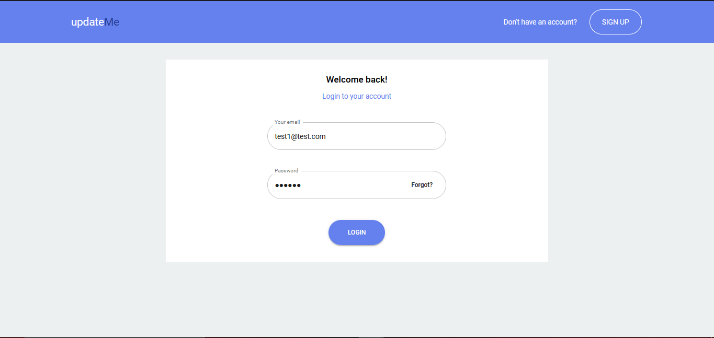

<!-- TABLE OF CONTENTS -->

  
Table of Contents

  <ol>
    <li>
      <a href="#about-the-project">About The Project</a>
      <ul>
        <li><a href="#built-with">Built With</a></li>
      </ul>
    </li>
    <li><a href="#usage">Usage</a></li>
    <li><a href="#acknowledgments">Acknowledgments</a></li>
  </ol>

<!-- ABOUT THE PROJECT -->
## About The Project

This is primarily a MERN stack project with the primary functionality of providing users with the latest posts about companies of their choice from various social media platforms. The main thought process that went behind making this project was instead of having to visit different social media platforms to know what is being said about companies of interest, why not all the news/posts from the famous platforms came to the user in a single location. All the searched entries are stored and retrived from MongoDB. In the backend, a cron job has been setup that will run with the help Bull and Redis, periodically querying for the companies and storing the posts in the database. Finally, the users will get a weekly newsletter with the top posts about the companies. This was done with the help of SendGrid.

(<a href="#top">back to top</a>)

### Built With

* React.js
* Material-UI
* React-Router
* Node
* Express.js
* Axios
* Socket.io
* MongoDB
* Redis
* Bull

(<a href="#top">back to top</a>)

<!-- USAGE EXAMPLES -->
## Usage

Users logging in the first time will need to register as shown below, where they will enter their email, setup a password and also enter a company name of their choice. Additionally, new users will receive an autogenerated welcome email that has the top 10 mentions of their chosen company:

Returning users will simply login using their existing credentials:

Once logged in, users will be taken to the homepage/dashboard where they will be able to see the posts/mentions about the company they chose. Users will get a range of filtering options. Firstly, which platforms do they want to see the posts from on the left. Then, filtering the mentions themselves based on date (Most recent), likes (Most popular) and text content vibe (sentiment). Users will also be able to like mentions by clicking on the heart icon at the bottom right of the mention:

Clicking a particular mention will open a dialog box as shown below, which will all the details of the mentiona along with a link "VISIT PAGE" that will allow the user to visit the original URL from which the post was imported:

Clicking on the settings icon at the top right corner will take the user to the Settings page where they can add/remove multiple companies to get posts from. Additionally, they can also modify the email

(<a href="#top">back to top</a>)

## Acknowledgments

* [Hatchways](https://www.hatchways.io/)
* [Traversy Media](https://www.youtube.com/c/TraversyMedia)
* [Lama Dev](https://www.youtube.com/c/LamaDev)
* [Devistry](https://www.youtube.com/c/Devistry)
* [SendGrid](https://sendgrid.com/)
* [GitHub Pages](https://pages.github.com)
* [Sentiment Analysis](https://www.npmjs.com/package/sentiment-analysis)

(<a href="#top">back to top</a>)

